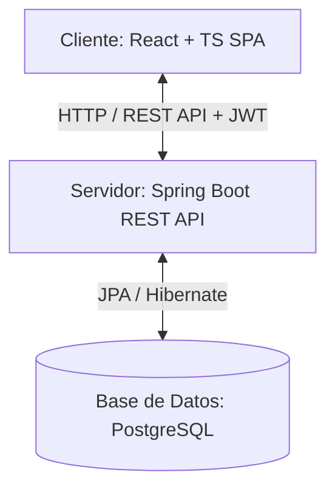

# ⚽ Quiniela Mundial 2026 - World Cup Predictor

[](https://www.oracle.com/java/)
[](https://spring.io/projects/spring-boot)
[](https://react.dev/)
[](https://www.typescriptlang.org/)
[](https://vite.dev/)
[](https://www.postgresql.org/)
[](https://www.docker.com/)

**Quiniela Mundial 2026** es una plataforma web full-stack diseñada para permitir a los usuarios pronosticar los resultados de los partidos de la Copa Mundial de la FIFA 2026. Los participantes compiten en tiempo real en una clasificación basada en puntos obtenidos por aciertos, visualizan dinámicamente la fase de eliminación directa (bracket) y administran salas de predicciones.

---

## 🚀 Características Principales

*   **Autenticación y Seguridad**: Registro e inicio de sesión seguro basado en roles (`USER` y `ADMIN`) utilizando **JWT (JSON Web Tokens)** con Spring Security.
*   **Gestión de Pronósticos (Quinielas)**: Los usuarios pueden registrar y editar sus predicciones para los partidos hasta una fecha y hora límite de bloqueo dinámico.
*   **Fase de Eliminación Directa Interactiva**: Un **bracket dinámico de llaves** que visualiza las rondas eliminatorias (16avos, 8avos, cuartos, semifinal y final).
*   **Tabla de Clasificación (Leaderboard)**: Ranking de participantes calculado dinámicamente de acuerdo a las reglas de puntuación por acierto de resultados.
*   **Panel de Administración Integral**:
    *   Gestión de selecciones nacionales y encuentros deportivos.
    *   Actualización de marcadores oficiales y avance de fases.
    *   Cálculo masivo automatizado de puntajes para los competidores.
*   **Auto-Sembrado de Base de Datos (Auto-Seeding)**: Al iniciar la aplicación por primera vez, el backend detecta si la base de datos está vacía e importa de forma automática toda la información de equipos y calendarios del torneo.
*   **Documentación de API Integrada**: Configuración de **Swagger / OpenAPI 3** para explorar y probar los endpoints REST directamente desde el navegador.

---

## 🛠️ Stack Tecnológico

### Backend
*   **Lenguaje:** Java 17
*   **Framework:** Spring Boot (v4.0.6) con Spring WebMVC
*   **Seguridad:** Spring Security & JWT (io.jsonwebtoken)
*   **Persistencia:** Spring Data JPA & Hibernate
*   **Base de Datos:** PostgreSQL 15
*   **Documentación:** Springdoc OpenAPI UI (Swagger)
*   **Productividad:** Project Lombok, Validation API

### Frontend
*   **Librería Principal:** React 19 (con TypeScript)
*   **Empaquetador/Entorno:** Vite 8
*   **Rutas:** React Router DOM (v7)
*   **Estilos:** CSS3 Moderno (Vanilla CSS optimizado)
*   **Iconos:** Lucide React

---

## 📐 Arquitectura del Sistema

El proyecto implementa una arquitectura desacoplada cliente-servidor contenedorizada mediante Docker:



---

## ⚙️ Requisitos Previos

Asegúrate de tener instalados los siguientes componentes antes de iniciar la instalación:

*   [Docker](https://www.docker.com/) y [Docker Compose](https://docs.docker.com/compose/) (Recomendado)
*   o bien de forma manual:
    *   [Java Development Kit (JDK) 17](https://adoptium.net/)
    *   [Node.js (versión 20 o superior)](https://nodejs.org/) y `npm`
    *   [PostgreSQL (versión 15 o superior)](https://www.postgresql.org/)

---

## 🛠️ Guía de Ejecución Rápida

El sistema levantará automáticamente la base de datos PostgreSQL, el backend en Spring Boot y el frontend en React en contenedores independientes interconectados.

#### 1.  Clona el repositorio y ve al directorio raíz del proyecto:
    ```bash
    git clone [git-url]
    cd quinielaMundial
    ```
#### 2.  Inicia la aplicación:
    ```bash
    docker-compose up --build
    ```
#### 3.  Una vez finalizada la construcción (esperar apróximadamente 2 minutos):
1.  Abre una nueva terminal y navega al directorio del frontend:
    ```bash
    cd frontend
    ```
2.  Instala las dependencias necesarias:
    ```bash
    npm install
    ```
3.  Inicia el servidor de desarrollo:
    ```bash
    npm run dev
    ```
    *   **Frontend (Aplicación Web)**: Accede a [http://localhost:5173](http://localhost:5173)
    *   **Backend / API**: Disponible en `http://localhost:8080/api`
    *   **Documentación Swagger UI**: Accede a [http://localhost:8080/swagger-ui/index.html](http://localhost:8080/swagger-ui/index.html)

---

## 👤 Cuentas de Prueba por Defecto

El sistema inicializa automáticamente un usuario con rol de Administrador para facilitar las pruebas del panel de control:

*   **Usuario**: `admin`
*   **Contraseña**: `admin`
*   **Rol**: `ADMIN` (Permite ingresar marcadores reales, avanzar de ronda y actualizar los rankings).

*Nota: Cualquier visitante puede registrarse desde la pantalla de registro para obtener el rol estándar `USER` y realizar sus predicciones.*

---

## 🗄️ Inicialización Automática de Datos (Auto-Seeding)

Para facilitar la portabilidad del proyecto, el sistema cuenta con un flujo de inicialización automatizado en el backend. Los scripts SQL se encuentran en la carpeta [backend/src/main/resources/scripts](file:///home/noel/Desktop/mundial2026/quinielaMundial/backend/src/main/resources/scripts):

1.  **`teams.sql`**: Define las selecciones clasificadas y sus grupos de juego.
2.  **`group-stage-matches.sql`**: Genera el fixture completo de la fase de grupos del torneo.
3.  **`knockout-full.sql`**: Genera la estructura de llaves eliminatorias del torneo (Ronda de 32 / Dieciseisavos en adelante).

Este sembrado es ejecutado dinámicamente mediante Spring Boot (`ResourceDatabasePopulator`) en la primera ejecución, garantizando que el usuario tenga un entorno listo para usar al instante sin requerir importaciones manuales.

---

## 📄 Licencia

Este proyecto está bajo la Licencia MIT - ver el archivo [LICENSE](file:///home/noel/Desktop/mundial2026/quinielaMundial/LICENSE) para más detalles.